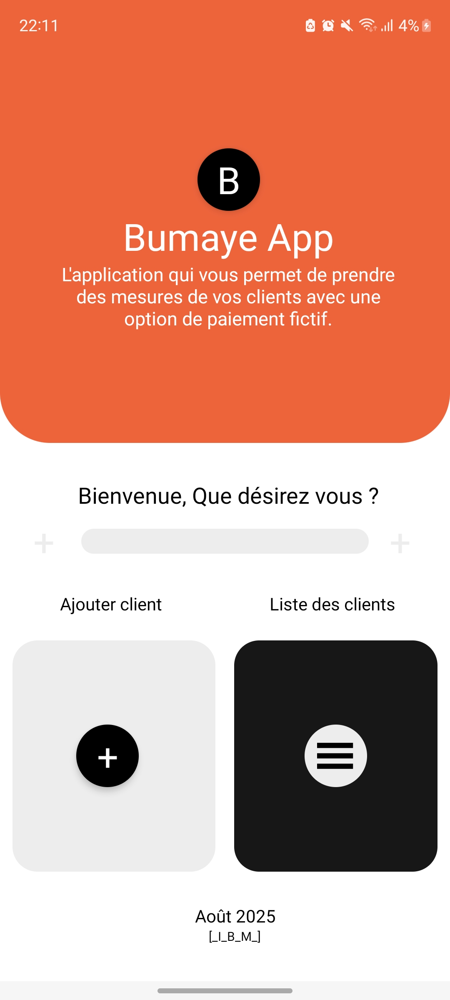
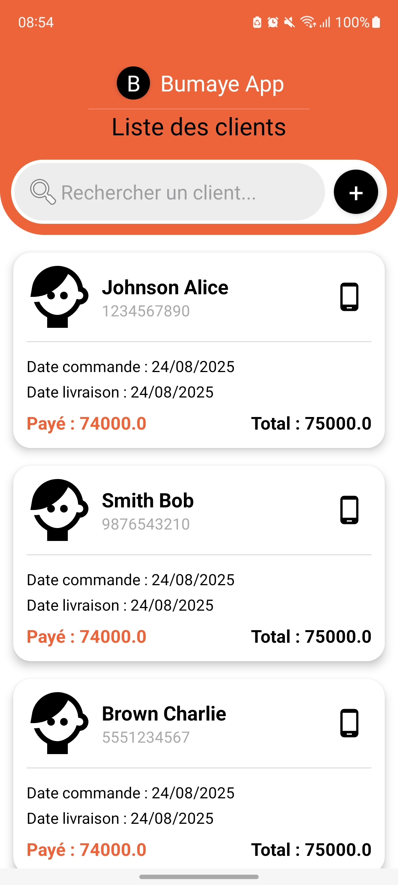
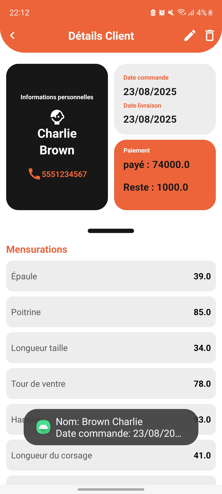
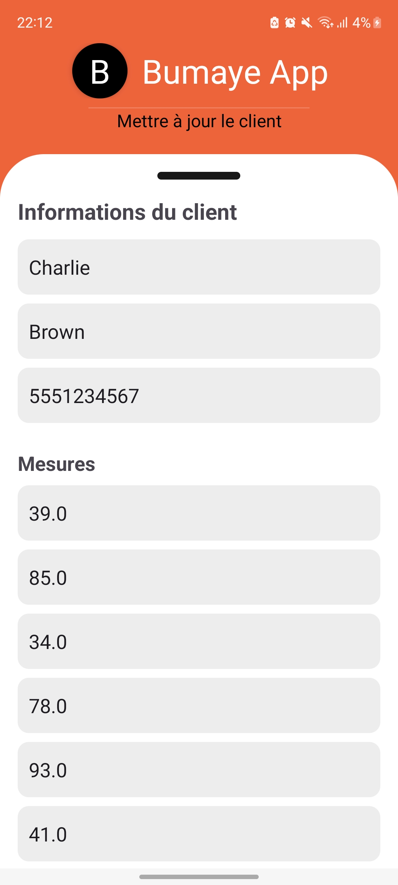
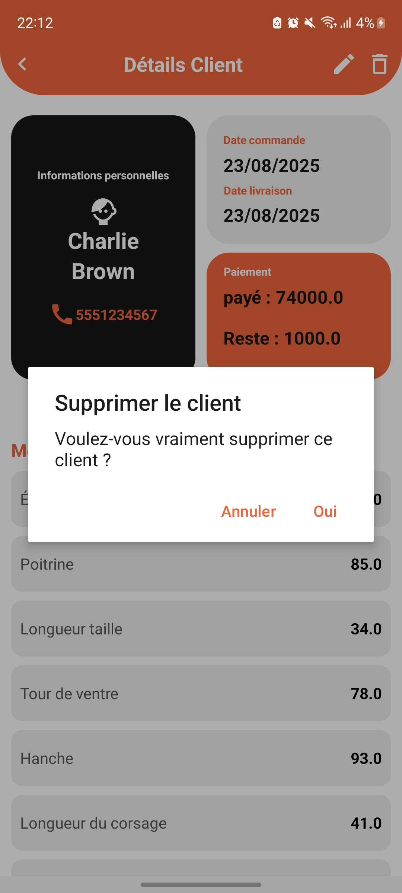

# 📱 Bumaye App

**Application mobile de gestion des mesures pour couturiers**, développée en **Kotlin** (avec option XML) dans le cadre de l'**épreuve d'examen d'initiation à la programmation Android et iOS**.  
Projet réalisé en individuel (niveau AL3 ADIDOGOMÉ).  

---

## 🚀 Fonctionnalités principales

- Page de garde / écran d'accueil.  
- 📋 Liste des clients enregistrés.  
- ➕ Ajout d'un client avec toutes ses mesures.  
- ✏️ Modification des informations d'un client existant.  
- 👀 Consultation complète d'un client (fiche détaillée).  
- 🗑️ Popup de confirmation pour suppression de client.  
- ⚖️ Règles de validation intégrées (noms, numéros, dates, montants).  
- Toutes les données sont **stockées en mémoire** (liste d'objets Kotlin).  

---

## 🛠️ Technologies utilisées

- **Langage :** Kotlin  
- **UI :** XML classique
- **Mode :** Développement individuel  
- **Données :** Liste en mémoire (pas de base de données / API)  

---

## 📂 Structure du projet

```plaintext
com.prenom.nom.bumaye_app
│
├── activities/
│   ├── MainActivity.kt          # Page de garde
│   ├── ClientListActivity.kt    # Liste des clients
│   ├── AddClientActivity.kt     # Formulaire ajout
│   ├── EditClientActivity.kt    # Formulaire modification
│   ├── ClientDetailActivity.kt  # Voir détails
│   ├── ClientAdapter.kt         # Adapter pour RecyclerView
│   └── Client.kt                # Classe modèle (mesures)
│
├── utils/
│   └── ValidationUtils.kt       # Fonctions de validation
│
└── res/
    ├── layout/                  # Fichiers XML UI
    ├── drawable/                # Styles, icônes, backgrounds
    └── values/                  # Couleurs, strings, styles
```

---

## 📝 Champs d'un client

* **Informations personnelles :** Nom et prénoms, numéro de téléphone.
* **Mesures :** épaule, poitrine, longueur taille, hanche, corsage, ceinture, jupe, robe, pantalon, manche, cuisse, genoux, bas, etc.
* **Suivi de commande :** date de commande, date de livraison.
* **Paiement :** somme totale, avance, reste (calculé automatiquement).

---

## 🔒 Contraintes & validations

* Nom et numéro obligatoires.
* Numéro de téléphone = chiffres uniquement (8 à 12 caractères).
* Date de livraison ≥ date de commande.
* Montants (somme / avance) doivent être positifs.
* Le reste est calculé automatiquement.
* Message d'erreur si les données sont invalides.

---

## 📷 Captures d'écran

👉 Les captures d'écran doivent être ajoutées dans le dossier `screenshots/` du projet et référencées ici.

* Page d'accueil

* Liste des clients

* Formulaire ajout

* Fiche client (détails)

* Modification client

* Popup suppression


---

## 🚀 Installation et utilisation

### Prérequis
- Android Studio Arctic Fox ou version ultérieure
- SDK Android 21 ou supérieur
- Kotlin 1.5 ou supérieur

### Installation
1. Cloner le repository
```bash
git clone https://github.com/ibraum/BUMAYE_APP.git
```

2. Ouvrir le projet dans Android Studio

3. Synchroniser les dépendances Gradle

4. Lancer l'application sur un émulateur ou appareil Android

---

## 📌 Notes importantes

* **Nom du projet :** `Bumaye App`
* Projet à livrer sous forme de **.zip** + captures d'écran + ce README.

---

## 📋 Checklist de livraison

- [ ] Code source complet et fonctionnel
- [ ] Toutes les fonctionnalités implémentées
- [ ] Validations et contraintes respectées
- [ ] Captures d'écran de toutes les pages
- [ ] Documentation README complète
- [ ] Fichier ZIP du projet

---

## 👨‍💻 Auteur

Projet réalisé par **KONDO IBRAHIM** dans le cadre de l'épreuve d'examen de fin de module.

**Niveau :** AL3 ADIDOGOMÉ  
**Module :** Initiation à la programmation Android et iOS  
**Date :** 19 Aôut 2025

---

## 📞 Contact

Pour toute question concernant ce projet :
- Email : ibraumodnokpro@gmail.com
- Téléphone : +228 93677690

---

*Ce projet est réalisé à des fins pédagogiques dans le cadre de la formation en développement mobile.*